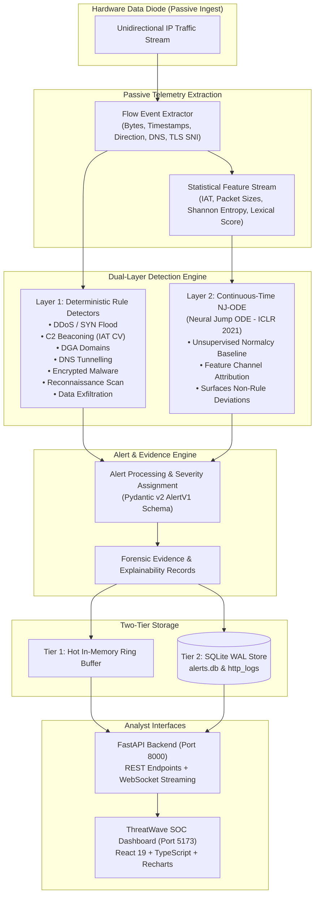
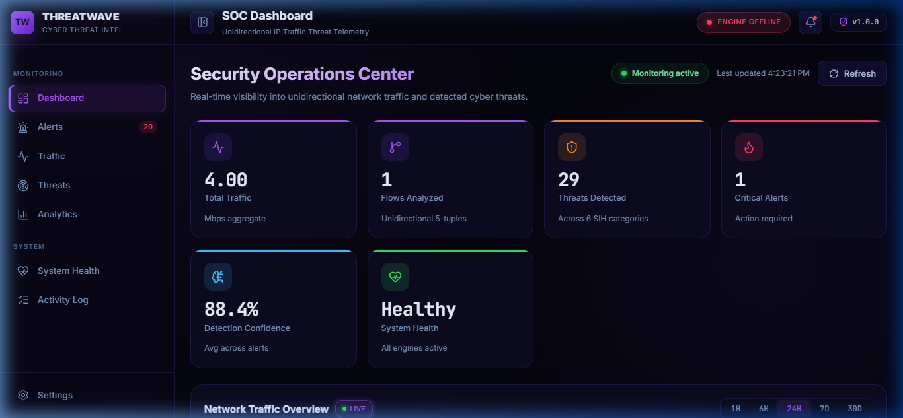
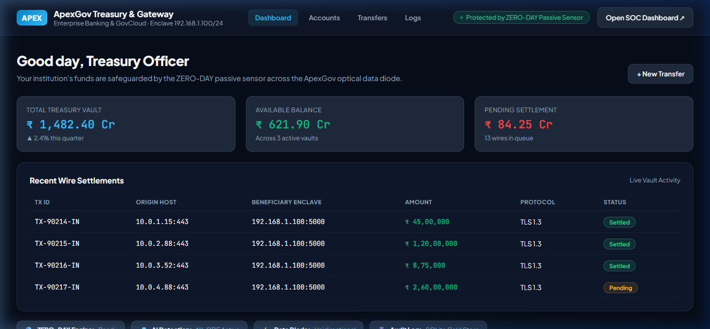
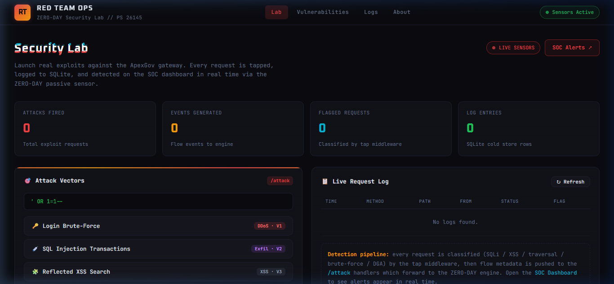

# 🔒 ThreatWavee — SIH26145

**AI-Powered Cyber Threat Detection for Unidirectional IP Traffic**

> **Smart India Hackathon 2026** | **Problem Statement ID:** 26145 | **Organization:** National Technical Research Organisation (NTRO)

[]()
[]()
[]()
[]()
[]()
[]()

---

## ⚡ The 30-Second Summary

* **WHAT:** ThreatWave is a dual-layer cyber threat detection and security analytics platform engineered specifically for **unidirectional network traffic** behind hardware data diodes.
* **WHY:** High-security critical infrastructure (defence networks, government intranets, SCADA plants) relies on data diodes to copy network traffic into monitoring enclaves in **one direction only**. Because return traffic is physically impossible, security tools cannot actively probe, perform TCP handshakes, or inline-block traffic.
* **FOR WHOM:** **NTRO (Problem Statement 26145, SIH 2026)** — providing passive, explainable, zero-blindspot threat observation across critical enclaves.
* **HOW:** ThreatWave pairs **7 high-throughput deterministic rule detectors** with an **unsupervised continuous-time Neural Jump ODE (NJ-ODE)** model to detect known threat signatures and surface anomalous deviations without payload decryption.

---

## 🎯 At a Glance

* **Physical Constraint:** Designed strictly for passive observation across physical data diodes — zero active probes, zero inline blocking, zero return packets.
* **Dual-Engine Architecture:** Layer 1 provides microsecond rule detection for high-rate attacks; Layer 2 uses continuous-time Neural Jump ODEs (ICLR 2021) to detect behavioral deviations with feature channel attribution.
* **Payload Privacy Compliance:** Operates exclusively on streaming flow metadata (packet sizes, timing, Shannon entropy, n-gram lexical metrics, and TLS/QUIC handshakes) — no payload decryption required.
* **End-to-End Demonstration:** Features a complete 3-website ecosystem: the **ThreatWave SOC Dashboard**, an **ApexGov Mock Target Banking Portal** with live diode tapping, and the **Red Team Ops Security Lab** attack console.
* **Validated Implementation:** 26/26 automated unit and integration tests passing, verified JSONL scenario replay engine, and SQLite cold-store persistence with real-time WebSocket feeds.

---

## 🎯 Problem & Operational Constraints

### The Hardware Data Diode Reality

Critical-infrastructure operators isolate sensitive enclaves using **hardware data diodes** — optical or electronic links that physically enforce one-way communication. A monitoring enclave receives a mirror of outbound network packets, but the physical layer prevents any signal from traveling back.

```text
Protected Enclave                     Hardware Data Diode               Monitoring Enclave
┌──────────────────┐                     ┌─────────┐                    ┌──────────────────┐
│ Critical Server  │ ────── Packets ────►│ Optical │───── Packets ─────►│ ThreatWave Engine│
│ Database / SCADA │      (One-Way)      │ Isolator│      (One-Way)     │ (Passive Ingest) │
└──────────────────┘                     └────┬────┘                    └────────┬─────────┘
                                              │                                  │
                                     PHYSICAL RETURN BLOCKED              NO ACTIVE PROBES
                                     NO TCP SYN/ACK POSSIBLE              NO INLINE BLOCKING
```

### Engineering Challenges Imposed by the Constraint

1. **No Active Probing:** Traditional scanners (Nmap, Nessus, active banner grabs) cannot send probes or measure host responses.
2. **No Inline Mitigation:** The detection engine cannot inject TCP RST packets, modify firewall rules inline, or trigger active proxies.
3. **No Payload Decryption:** In high-assurance environments, inspecting encrypted payloads is legally or operationally impermissible; detection must rely strictly on metadata, timings, sizes, and entropy.
4. **Streaming Throughput Requirement:** Ingestion cannot buffer unbounded batches; it must process flows as an event stream with bounded memory.

---

## 💡 Our Solution: Dual-Layer Passive Threat Detection

ThreatWave addresses these constraints by pairing fast deterministic rule engines with an unsupervised continuous-time machine learning model:



### Why This Architecture?

```text
Unidirectional Network
        ↓
Passive Observation
        ↓
Telemetry / Flow Metadata Extraction
        ↓
Dual-Layer Detection (Rules + NJ-ODE)
        ↓
Standardized Alert + Forensic Evidence
        ↓
Analyst SOC Triage & Investigation
```

---

## ⚡ Core Innovation: Dual-Engine Threat Intelligence

ThreatWave rejects single-model fragility in favor of a complementary two-layer strategy:

```text
Known Threat Patterns                        Novel / Unseen Anomalies
          │                                              │
          ▼                                              ▼
┌───────────────────────────────┐              ┌───────────────────────────────┐
│     LAYER 1: RULE DETECTORS   │              │     LAYER 2: NJ-ODE MODEL     │
│ • Deterministic heuristics    │              │ • Continuous-time jump ODE    │
│ • Microsecond event latency   │              │ • Unsupervised normalcy prior │
│ • Explicit rule thresholds    │              │ • Surfaces non-rule deviations│
└──────────────┬────────────────┘              └───────────────┬───────────────┘
               │                                               │
               └───────────────────────┬───────────────────────┘
                                       ▼
                       ┌───────────────────────────────┐
                       │    UNIFIED ALERT ENGINE       │
                       │ • Standardized Pydantic v2    │
                       │ • Auto-calibrated severity    │
                       │ • Detailed forensic reasons   │
                       └───────────────┬───────────────┘
                                       ▼
                        SOC Analyst Triage & Remediation
```

### 1. Layer 1 — High-Throughput Deterministic Rules
* **Role:** Evaluates high-rate traffic against known attack heuristics.
* **Characteristics:** Microsecond evaluation, bounded memory footprint, zero false positives on known compliance patterns, and instantly actionable human-readable evidence.

### 2. Layer 2 — Continuous-Time Neural Jump ODE (NJ-ODE)
* **Role:** Models the **conditional expectation of benign network traffic dynamics** as a continuous-time jump process (Herrera, Krach & Teichmann, ICLR 2021).
* **Characteristics:** Trained purely on benign traffic (no attack labels required); designed to surface anomalous behavior that may not match predefined rules.
* **Channel Attribution:** Decomposes anomaly scores across individual feature dimensions (IAT, packet size, byte ratio, Shannon entropy) so analysts know *why* an anomaly was flagged.

---

## ✅ What We Built

| Subsystem | Implemented Component | Source Location | Status |
|---|---|---|---|
| **Detection Layer 1** | 7 Rule Detectors (SYN flood, UDP amp, C2 beacon, DGA, DNS tunnel, TLS malware, Port scan, Exfiltration) | `src/zero_day/rules/` | ✅ Implemented & Tested |
| **Detection Layer 2** | Continuous-Time Neural Jump ODE model with decay and jump networks | `src/zero_day/njode.py` | ✅ Implemented & Tested |
| **Feature Extraction** | Shannon entropy, DNS label lexical metrics, n-gram scoring, IAT statistics | `src/zero_day/features.py` | ✅ Implemented & Tested |
| **Windowing & Feeder** | Fixed-grid observation windows and live streaming feeder | `src/zero_day/windowing.py` | ✅ Implemented & Tested |
| **Backend API** | FastAPI REST endpoints + real-time WebSocket alert streamer (`/ws/alerts`) | `src/zero_day/api.py` | ✅ Running on `:8000` |
| **Analyst Dashboard** | React 19 + TypeScript + Vite SOC dashboard with interactive charts | `frontend/` | ✅ Running on `:5173` |
| **Demo Target Portal** | ApexGov Enterprise Banking enclave with passive data diode flow tap | `src/zero_day/mock_target/server.py` | ✅ Running on `:5000` |
| **Security Lab** | Red Team Ops cyber attack console with 8 interactive threat scenarios | `redteam/` | ✅ Running on `:7700` |
| **Storage Engine** | Two-tier architecture: RAM hot queue + SQLite WAL cold store (`alerts.db`) | `src/zero_day/db.py` | ✅ Implemented |
| **Replay & Benchmark** | JSONL scenario playback engine and performance benchmark harness | `src/zero_day/replay.py` | ✅ Implemented |
| **Test Suite** | 26 automated unit and integration tests | `tests/test_core.py` | ✅ 26/26 Passing |

---

## 🖥️ Three-Part Demonstration Environment

ThreatWave is delivered with a complete three-website demonstration environment that allows evaluators to simulate attacks, observe passive network data diode ingestion, and investigate alerts in the SOC console.

<p align="center">
  
  
</p>
<p align="center">
  <em><b>Left:</b> ThreatWave SOC Analyst Dashboard (React 19 / TypeScript) — Real-time threat radar, event throughput metrics, and detector feeds.<br>
  <b>Right:</b> ApexGov Enterprise Banking & GovCloud Gateway — Controlled mock target enclave with live passive data diode tap.</em>
</p>

<p align="center">
  
</p>
<p align="center">
  <em><b>Red Team Ops Security Lab</b> — Interactive cyber attack simulation console for triggering volumetric DDoS, C2 beacons, DGA domains, DNS tunneling, and data exfiltration.</em>
</p>

---

### Detailed Breakdown of the Three Web Interfaces

#### 01 — ThreatWave SOC Analyst Dashboard (`http://localhost:5173`)
* **What It Is:** The primary interface for security operations center (SOC) analysts to monitor, investigate, and triage cyber threats detected in unidirectional traffic.
* **Why It Exists:** To provide analysts with instant situational awareness, visual threat breakdown, real-time alert feeds, and granular evidence drilldowns.
* **What the User Sees:**
  * System operational status and passive diode health indicator.
  * Real-time metrics: events processed, alerts emitted, events per second, and active detector count.
  * Threat matrix breakdown categorized across the 6 official problem statement threat classes.
  * Live alert feed with severity tags (`CRITICAL`, `HIGH`, `MEDIUM`), confidence scores, and timestamps.
  * Detailed forensic evidence drawer showing exact threshold crossings and contributing features.
* **What the User Can Do:**
  * Filter and search alerts by severity, threat class, or lifecycle status (`New`, `Investigating`, `Acknowledged`, `Resolved`).
  * Trigger real-time scenario replays (`syn_flood`, `port_scan`, `dga_domains`, etc.) directly from the UI.
  * Inspect historical SQLite logs and forensic evidence records.
* **Backend Interaction:** Connects via WebSocket (`/ws/alerts`) to receive live alerts and polls REST endpoints (`/api/alerts`, `/api/metrics`, `/api/health`).

| Visible Component | Purpose in Interface | Contribution to Triage / Detection |
|---|---|---|
| **Metrics Bar** | Displays total events, alert counts, and live throughput | Proves real-time processing performance |
| **Threat Matrix** | Visual breakdown by threat class | Identifies dominant attack vectors at a glance |
| **Forensic Alert Table** | Lists alerts with flow ID, source/dest IPs, severity, and confidence | Enables rapid analyst triage and status management |
| **Evidence Drawer** | Expands individual alerts to display specific numeric reasons | Provides explainable evidence without decrypting payloads |

---

#### 02 — ApexGov Enterprise Banking & GovCloud Gateway (`http://localhost:5000`)
* **What It Is:** A controlled mock enterprise banking and government cloud portal (`src/zero_day/mock_target/server.py`) simulating an enclave server (`192.168.1.100`).
* **Why It Exists:** Demonstrates realistic application traffic and proves how passive data diode taps observe transactions and attacks without interfering with services.
* **What the User Sees:**
  * ApexGov Treasury dashboard with accounts, balances, and wire transfer interfaces.
  * Real-time "Protected by ZERO-DAY Passive Sensor" status indicator.
  * Live HTTP request log feed recording status codes, client IPs, and passive sensor flags.
  * Built-in red-team test triggers for simulating web exploits (SQLi, XSS, brute-force, path traversal).
* **What the User Can Do:**
  * Perform simulated banking transfers, navigate accounts, or trigger exploitable endpoints.
  * Trigger localized attacks and observe how they are logged without impacting application availability.
* **Backend Interaction:** Every HTTP transaction passes through passive middleware (`_tap_flow`), which extracts flow metadata and passively forwards it to the ThreatWave engine (`:8000`) and SQLite cold-store table `http_logs`.

| Visible Component | Purpose in Interface | Contribution to Triage / Detection |
|---|---|---|
| **Treasury & Accounts** | Simulates legitimate user activity | Generates realistic benign baseline traffic |
| **Passive Sensor Pill** | Displays diode connection state | Confirms passive monitoring is active |
| **Audit Logs Table** | Shows intercepted HTTP transactions | Proves all traffic is recorded to SQLite cold store |
| **Exploit Trigger Grid** | Allows manual invocation of specific exploits | Exercises the passive sensor with real web requests |

---

#### 03 — Red Team Ops Security Lab (`http://localhost:7700`)
* **What It Is:** An interactive attack generation console (`redteam/serve.py` + `redteam/index.html`) providing controlled simulation of the 6 threat classes.
* **Why It Exists:** Enables evaluators to generate reproducible attack traffic and observe detection pipeline reactions in real time.
* **What the User Sees:**
  * Attack vector selection cards corresponding to each problem statement category.
  * Target configuration options (rate, destination IP, packet size, duration).
  * Interactive terminal output displaying generation progress and packet counts.
* **What the User Can Do:**
  * Launch pre-configured attack scenarios: SYN flood, C2 beaconing, DGA query bursts, DNS tunneling, encrypted C2 sessions, and port scanning.
  * Observe terminal feedback showing packets generated and delivered to the target.
* **Backend Interaction:** Executes attack scripts or triggers the ThreatWave backend replay endpoint (`/api/replay/{scenario}`), injecting flows directly into the detection pipeline.

| Visible Component | Purpose in Interface | Contribution to Triage / Detection |
|---|---|---|
| **Attack Vector Matrix** | Buttons for each supported attack scenario | Allows targeted testing of individual detectors |
| **Terminal Output** | Live log of simulated packets and timestamps | Gives evaluators real-time confirmation of attack launch |
| **Scenario Parameters** | Configures attack rate and volume | Tests detector sensitivity and threshold behavior |

---

## 🔗 How the Three Interfaces Work Together

The three web interfaces form a closed-loop demonstration environment:

```text
┌─────────────────────────────────────────────────────────────┐
│                 1. RED TEAM OPS LAB (:7700)                 │
│  Generates realistic cyber attack scenarios & traffic bursts │
└──────────────────────────────┬──────────────────────────────┘
                               │ Attack Traffic
                               ▼
┌─────────────────────────────────────────────────────────────┐
│                 2. APEXGOV MOCK TARGET (:5000)              │
│  Enterprise banking portal receives requests & processes flow│
└──────────────────────────────┬──────────────────────────────┘
                               │
                               ▼ [Hardware Data Diode Tap]
                 PASSIVE FLOW TELEMETRY ONLY
                 (No return packets / No inline blocks)
                               │
                               ▼
┌─────────────────────────────────────────────────────────────┐
│                 3. THREATWAVE DETECTION (:8000)             │
│  • Layer 1: Rule Detectors (SYN, IAT, DGA, Tunnel, Exfil)   │
│  • Layer 2: NJ-ODE Continuous-Time Anomaly Baseline         │
│  • Engine: Assigns severity, confidence & evidence records  │
└──────────────────────────────┬──────────────────────────────┘
                               │ WebSocket Alert Stream
                               ▼
┌─────────────────────────────────────────────────────────────┐
│              4. THREATWAVE SOC DASHBOARD (:5173)            │
│  Analyst visualizes alerts, reviews evidence & manages triage│
└─────────────────────────────────────────────────────────────┘
```

**Workflow in Plain English:**
1. **Red Team Ops** triggers a controlled attack scenario (e.g., DNS Tunneling or C2 Beaconing).
2. The **ApexGov Mock Target** receives the traffic and processes the transaction as normal.
3. The **Passive Data Diode Tap** mirrors the flow metadata (IPs, ports, byte sizes, inter-arrival times, DNS queries) across the one-way link to ThreatWave.
4. **ThreatWave Detection Engines** analyze the streaming metadata: rules check for known thresholds; NJ-ODE evaluates behavioral deviation.
5. An alert is generated with confidence and human-readable evidence.
6. The **SOC Analyst Dashboard** displays the new alert in real time via WebSocket, allowing the analyst to inspect the forensic evidence and update incident status.

---

## 🎬 Demonstration Story: Step-by-Step Scenario

Here is an end-to-end walkthrough of a **Botnet C2 Beaconing** attack scenario:

```text
STEP 1: Select Attack Scenario in Red Team Ops
        Analyst clicks "Botnet C2 Beacon" in Red Team Ops (:7700).
        Traffic generator initiates periodic outbound requests with fixed intervals (5.0s ± 0.01s).
                            ↓
STEP 2: Traffic Reaches the Protected Enclave
        Requests target the ApexGov Banking Portal (:5000). The service responds normally.
                            ↓
STEP 3: Passive Data Diode Interception
        The passive tap extracts flow metadata (src=10.0.0.50, dst=185.234.72.10:443, protocol=TCP).
        No return path is opened to the target or sender.
                            ↓
STEP 4: Detection Engine Ingestion
        The stream reaches `BeaconDetector` in `src/zero_day/rules/`.
        The detector tracks rolling inter-arrival times (IAT) over a 60-second observation window.
                            ↓
STEP 5: Statistical Threshold Triggering
        `BeaconDetector` calculates the IAT coefficient of variation:
        CV = std(IAT) / mean(IAT) = 0.0072 (far below the 0.15 regularity threshold).
        High periodicity flags automated beaconing behavior.
                            ↓
STEP 6: Standardized Alert Generation
        AlertEngine constructs a Pydantic v2 `AlertV1` object:
        • Threat Class: `botnet_c2_beacon`
        • Severity: `HIGH` (confidence: 0.96)
        • Evidence: "IAT coefficient of variation = 0.0072 — highly periodic"
                            ↓
STEP 7: Live SOC Investigation
        ThreatWave SOC Dashboard (:5173) receives the alert instantly via WebSocket.
        The alert drawer displays exact timestamp, flow ID, and evidence for forensic sign-off.
```

---

## 🛡️ Threat Coverage & Detection Mechanisms

ThreatWave covers all required threat categories using passive flow observables:

| # | Threat Class | Detection Mechanism | Primary Observable Features | Example Evidence Output |
|---|---|---|---|---|
| **a** | **Volumetric / Protocol DDoS** | Layer 1 SYN/UDP flood detector + Layer 2 volume anomaly | High SYN rate without ACK, source IP entropy, amplification ports (53, 123, 1900) | `150 SYN-only packets in 10s window (threshold: 100); 25 unique source IPs` |
| **b** | **Botnet C2 Beaconing** | Inter-arrival time (IAT) analysis + coefficient of variation (CV) | Low IAT variance, repeated connections to single destination IP:port | `IAT coefficient of variation = 0.0072 (threshold: 0.15) — highly periodic` |
| **c** | **DGA Domains** | Lexical analysis + Shannon entropy + vowel/consonant ratio | Query string entropy, digit ratio, length, absence of dictionary words | `DGA lexical score = 0.8421 (threshold: 0.55); query entropy: 3.82 bits` |
| **d** | **DNS Tunnelling** | Query length + record type anomalies + high-volume source tracking | Length > 50 chars, base32/hex label entropy, unusual record types (TXT, NULL) | `DNS query length 78 chars exceeds 50; query entropy 3.91 bits; TXT record` |
| **e** | **Encrypted Session Malware** | TLS/QUIC handshake metadata analysis (no payload decryption) | Fixed packet size uniformity, periodic timing intervals, JA3 fingerprinting | `Packet size CV = 0.0412 — unusually uniform sizes suggest automated malware` |
| **f** | **Reconnaissance / Port Scan** | Fan-out tracking across destination ports and hosts | High SYN count to >= 15 unique destination ports or IPs from a single source | `Fan-out to 24 unique destination ports in 10s window (horizontal scan)` |
| **g** | **Data Exfiltration** | Asymmetric volume tracking + outbound/inbound byte ratio | Outbound/inbound byte ratio >= 5.0:1, sustained high-volume transfer | `Outbound/inbound byte ratio = 24.3:1 (threshold: 5:1); 1.4 MB outbound` |

---

## 🔬 Research Foundation: Neural Jump ODE (NJ-ODE)

ThreatWave’s machine learning layer is built on the **Neural Jump ODE** framework ([Herrera, Krach & Teichmann, ICLR 2021](https://arxiv.org/abs/2006.04727)).

```text
Published Research                          ThreatWave Implementation                   Validation Scope
┌────────────────────────┐                  ┌────────────────────────┐                  ┌────────────────────────┐
│ ICLR 2021 Paper:       │                  │ src/zero_day/njode.py: │                  │ Continuous integration │
│ Continuous-time neural │ ───────────────► │ Implements decay ODE,  │ ───────────────► │ tests verify math,     │
│ ODEs for irregularly   │   Integrated as  │ jump network, rolling  │   Tested on      │ shapes, objective      │
│ sampled time series.   │   Layer 2 Model  │ windowing & channel    │   fixtures       │ reduction, and channel │
└────────────────────────┘                  │ attribution.           │                  │ attribution.           │
                                            └────────────────────────┘                  └────────────────────────┘
```

* **Why NJ-ODE for Data Diodes?** Network traffic arrives irregularly. Traditional discrete-time models (RNNs/LSTMs) assume uniform time steps. NJ-ODE models the latent state between packet arrivals using continuous-time ordinary differential equations:
  $$\frac{dh(t)}{dt} = f_\theta(h(t))$$
  When a packet arrives at time $t_i$, the state makes a discontinuous jump:
  $$h(t_i) = g_\phi(h(t_i^-), x_i)$$
* **Unsupervised Anomaly Detection:** The model is trained on normal traffic. When an observed packet sequence deviates significantly from the expected trajectory, the prediction error increases, signaling an anomaly without requiring prior attack labels.
* **Channel Attribution:** Error is decomposed across feature channels (IAT, packet size, entropy), enabling explainable alert outputs.

---

## 📊 Validation & Testing

All verification metrics are drawn directly from reproducible tests and benchmarks in the repository:

### 1. Automated Test Suite (26/26 Passing)
The test suite (`tests/test_core.py`) verifies contracts, feature extractors, NJ-ODE mathematical mechanics, rolling-window aggregation, and all rule detectors:

```bash
$env:PYTHONPATH="src"; pytest tests/ -v
# Result: 26 passed in ~11.7 seconds
```

### 2. Throughput Benchmarking
* **Rule Engine Throughput:** The deterministic rule engine achieves high-throughput event processing (`~40K events/sec` for rules in isolation on commodity hardware; `~600 events/sec` with full windowing, logging, and metrics recording).
* To run the benchmark harness on your hardware:
  ```bash
  $env:PYTHONPATH="src"; python -m zero_day.cli benchmark --events 5000
  ```

### 3. Pre-Recorded Attack Replay Scenarios
The repository includes 8 JSONL scenario fixtures in `data/fixtures/` exercising every supported threat class:
* `syn_flood.jsonl` (Volumetric DDoS)
* `c2_beacon.jsonl` (Botnet C2 beaconing)
* `dga_domains.jsonl` (DGA DNS lookups)
* `dns_tunnel.jsonl` (High-entropy DNS exfiltration)
* `encrypted_c2.jsonl` (TLS metadata beaconing)
* `port_scan.jsonl` (Horizontal/vertical reconnaissance)
* `data_exfil.jsonl` (Asymmetric volume exfiltration)
* `full_scenario.jsonl` (Composite multi-stage attack scenario)

> *Validation Note:* Current quantitative validation uses synthetic attack and benign fixtures. Comprehensive benchmarking against external PCAP datasets (e.g., CIC-IDS2017) is part of ongoing evaluation.

---

## 🛠️ Technology Stack

| Domain | Technology | Version / Spec | Purpose in Project |
|---|---|---|---|
| **Frontend** | React + TypeScript | React 19, TypeScript 6, Vite 8 | Real-time SOC analyst dashboard |
| **Visualizations** | Recharts + Lucide | Recharts 3, Lucide-React | Threat radar, timeseries volume, metrics cards |
| **Backend API** | FastAPI + Uvicorn | FastAPI 0.100+, Uvicorn 0.23+ | REST endpoints + WebSocket streaming server |
| **Validation Schema** | Pydantic v2 | Pydantic >= 2.0 | Strict contract validation (`AlertV1`, `FlowEvent`) |
| **Machine Learning** | PyTorch | PyTorch >= 2.0, SciPy, NumPy | Continuous-time Neural Jump ODE model |
| **Feature Extraction** | SciPy + NumPy | SciPy >= 1.10, NumPy >= 1.24 | Shannon entropy, IAT stats, DNS lexical analysis |
| **Storage (2-Tier)** | SQLite WAL + Memory | SQLite 3 (WAL mode) + Python Queue | Hot ring buffer (RAM) + persistent cold storage |
| **Simulation Lab** | Vanilla CSS + HTML5 | Pure HTML5, CSS Grid, JetBrains Mono | Red Team Ops security lab & attack console |
| **Testing** | pytest | pytest >= 7.4 | Unit, integration, and mathematical test suite |

---

## 📁 Project Structure

```text
ThreatWave/
├── data/
│   ├── alerts.db              # SQLite cold-store (WAL mode) for alerts & http_logs
│   └── fixtures/              # 8 pre-recorded JSONL attack scenarios
├── deck/                      # Presentation deck specifications & slide assets
├── docs/                      # Technical architecture & vulnerability documentation
├── frontend/                  # React 19 + TypeScript + Vite SOC Dashboard
│   ├── src/
│   │   ├── components/        # AppShell, AlertTable, ThreatRadar, Toasts
│   │   ├── pages/             # Dashboard, Alerts, Traffic, Threats, Health
│   │   ├── services/          # FastAPI & WebSocket client service layer
│   │   └── types/             # TypeScript contracts matching Pydantic schemas
│   ├── package.json
│   └── vite.config.ts
├── redteam/                   # Red Team Ops Security Lab
│   ├── index.html             # Cyber attack console interface
│   └── serve.py               # Standalone HTTP server on port 7700
├── screenshots/               # Verified UI screenshots for documentation
├── src/zero_day/              # Core Python detection package
│   ├── api.py                 # FastAPI application & WebSocket handlers
│   ├── cli.py                 # CLI entry points (api, replay, train, benchmark)
│   ├── contracts.py           # Pydantic v2 schemas (AlertV1, FlowEvent, EvidenceItem)
│   ├── db.py                  # Two-tier SQLite WAL & in-memory storage manager
│   ├── engine.py              # Dual-layer AlertEngine orchestrator
│   ├── features.py            # Feature extractors (entropy, DNS, TLS metadata)
│   ├── mock_target/           # ApexGov enterprise banking mock target portal (:5000)
│   │   └── server.py          # FastAPI mock target with passive diode tap
│   ├── njode.py               # Neural Jump ODE PyTorch model
│   ├── replay.py              # Streaming JSONL replay engine
│   ├── rules/                 # 7 deterministic rule detector classes
│   └── windowing.py           # Fixed-grid windowing & LiveFeeder pipeline
├── tests/
│   └── test_core.py           # 26 unit and integration tests
├── demo.bat                   # Automated Windows demonstration launcher
└── pyproject.toml             # Python build configuration and dependencies
```

---

## 🚀 Quick Start Guide

### Prerequisites
* **Python:** 3.10 or 3.11+
* **Node.js:** v18+ (tested on Node v24)
* **Git**

### 1. Clone the Repository
```bash
git clone https://github.com/Kritvipaliwal/ThreatWave.git
cd ThreatWave
```

### 2. Set Up Python Dependencies
```bash
# Optional: create a virtual environment
python -m venv .venv
.venv\Scripts\activate      # Windows (or: source .venv/bin/activate on Linux/macOS)

pip install -e ".[dev]"
```

### 3. Run the Automated Tests (26 Passing)
```bash
$env:PYTHONPATH="src"       # Windows PowerShell (or: export PYTHONPATH=src on Linux/macOS)
pytest tests/ -v
```

### 4. Launch the Three Web Interfaces

#### Terminal 1: ThreatWave Backend Engine (Port 8000)
```powershell
$env:PYTHONPATH="src"
python -m zero_day.cli api --port 8000
```
*API Swagger UI accessible at: `http://localhost:8000/docs`*

#### Terminal 2: ThreatWave SOC Dashboard (Port 5173)
```bash
cd frontend
npm install
npm run dev
```
*SOC Dashboard accessible at: `http://localhost:5173`*

#### Terminal 3: ApexGov Mock Target Demo Portal (Port 5000)
```powershell
$env:PYTHONPATH="src"
python -m uvicorn zero_day.mock_target.server:app --port 5000
```
*Mock Banking Portal accessible at: `http://localhost:5000`*

#### Terminal 4: Red Team Ops Security Lab (Port 7700)
```bash
python redteam/serve.py
```
*Attack Console accessible at: `http://localhost:7700`*

---

### 5. Replaying Attack Scenarios from CLI

To test scenario replay without the web UI:
```bash
# Replay full attack scenario through the rule engine
$env:PYTHONPATH="src"
python -m zero_day.cli replay data/fixtures/full_scenario.jsonl --speed 0

# Benchmark detection throughput on 5000 synthetic events
python -m zero_day.cli benchmark --events 5000
```

---

## 🛣️ Roadmap

```text
CURRENT IMPLEMENTATION                 NEAR-TERM REFINEMENTS                 FUTURE SCOPE
┌───────────────────────────┐         ┌───────────────────────────┐         ┌───────────────────────────┐
│ • 7 deterministic rules   │         │ • PCAP ingestion bridge   │         │ • FPGA acceleration for   │
│ • NJ-ODE continuous model │ ──────► │   using AF_PACKET/DPDK    │ ──────► │   hardware data diodes    │
│ • FastAPI + React 19 UI   │         │ • Real-world benchmark on │         │ • Extended MITRE ATT&CK   │
│ • 3-website demo ecosystem│         │   CIC-IDS2017 & CSE-CIC   │         │   passive mapping         │
│ • 2-tier SQLite WAL store │         │ • Pre-trained checkpoints │         │ • Distributed enclaves    │
└───────────────────────────┘         └───────────────────────────┘         └───────────────────────────┘
```

* **Current Implementation:** Full dual-engine architecture, 7 rule detectors, NJ-ODE PyTorch implementation, standardized Pydantic v2 alert schemas, SQLite WAL storage, React 19 dashboard, and the complete 3-website demonstration environment.
* **Near-Term Refinements:** Native PCAP / live network interface capture bridge via Scapy / AF_PACKET; quantitative evaluation against benchmark datasets (CIC-IDS2017); pre-trained baseline checkpoints.
* **Future Scope:** Hardware-accelerated FPGA/DPDK passive stream capture for line-rate 10Gbps+ data diodes; automated correlation with MITRE ATT&CK tactics for passive air-gapped enclaves.

---

## 🌍 Potential Impact & Applications

* **National Security & Defence Enclaves:** Provides continuous threat visibility inside restricted networks that must communicate via hardware data diodes to eliminate exfiltration vectors.
* **Critical Infrastructure (SCADA / Power Grids):** Protects operational technology (OT) monitoring enclaves where active scanning can destabilize legacy industrial controllers.
* **Government Data Repositories:** Enables zero-blindspot audit trails and forensic log archival without introducing network attack surfaces.
* **Air-Gapped Cloud Ingress:** Monitors unidirectional software and telemetry imports into isolated environments without return-channel risk.

---

## 👥 Team & Submission Information

* **Team Name:** THREATWAVEE
* **Event:** Smart India Hackathon (SIH) 2026
* **Problem Statement ID:** 26145
* **Category:** Software
* **Organization:** National Technical Research Organisation (NTRO)
* **Problem Title:** AI-Based Detection of Cyber Threats in Unidirectional IP Traffic

---

## 📄 License

This project is licensed under the MIT License — see the [LICENSE](LICENSE) file for details.
